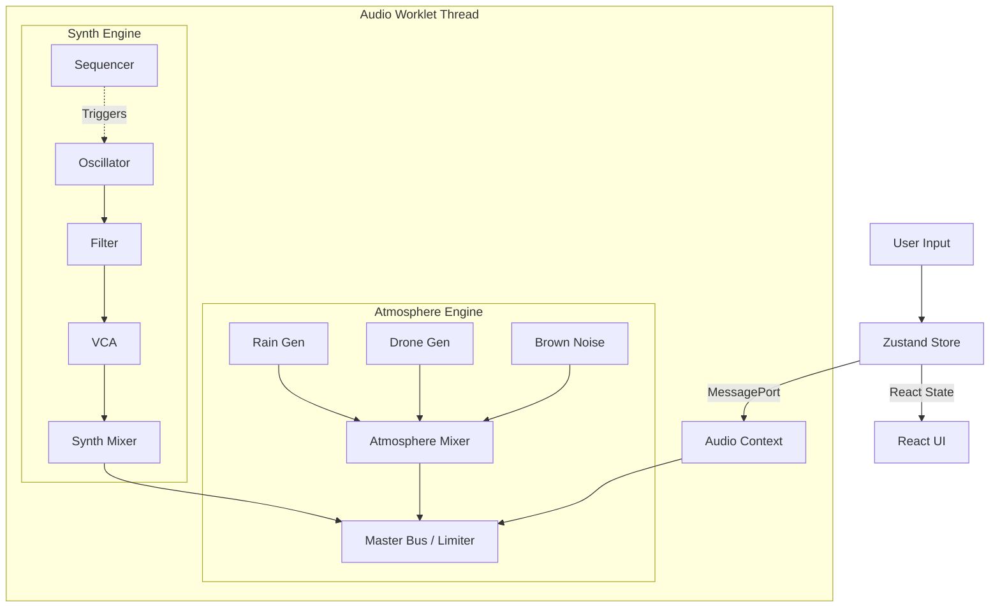

# Phase 2: Architecture & Tech Stack

> "Structure dictates function. To build a living ecosystem, we need a skeleton that can support growth."

## 1. The Technology Stack
We are doubling down on the modern web audio stack but refining how the pieces fit together.

### Core Frameworks
-   **Frontend**: `React 18+` (TypeScript) - The view layer.
-   **Build Tool**: `Vite` - For lightning-fast dev server and optimized builds.
-   **State Management**: `Zustand` - For transient, high-frequency state updates (knob twists, audio metering) without re-render thrashing.
-   **Visuals**: `React Three Fiber (R3F)` + `Drei` - For the "Neon-Organic" 3D interface and background visualizations.
-   **Graph UI**: `React Flow` - For the node editor interface (heavily customized).

### Audio Core
-   **Web Audio API**: The native browser audio engine.
-   **AudioWorklet**: **MANDATORY**. All DSP (Digital Signal Processing) must happen on the Audio thread, not the Main thread, to prevent UI jank from causing audio glitches.
-   **WASM (Future)**: We will structure the DSP modules to be replaceable with Rust/C++ WASM modules in Phase 10, but for now, optimized JavaScript/TypeScript in the Worklet is sufficient.

## 2. The "Schism" Architecture (Dual-Engine)
We are moving away from a single monolithic `AudioEngine` class to a composed system.



### A. The Atmosphere Engine
*   **Purpose**: Background texture, immersion, "filling the space."
*   **Characteristics**: High polyphony of simple noise sources, long convolution reverbs, stereo field recordings.
*   **Update Rate**: Low control rate (changes happen over seconds).

### B. The Synth Engine
*   **Purpose**: Musical events, melody, rhythm.
*   **Characteristics**: Precise timing, envelopes, complex modulation routing.
*   **Update Rate**: Audio rate (sample-accurate) or high control rate (100Hz+).

### C. The Bridge (Messaging System)
Communication between the UI and the AudioWorklet is the bottleneck. We will use a strict **Command Pattern**:
1.  UI triggers an action (`setFrequency(440)`).
2.  Zustand updates the UI state immediately (optimistic).
3.  Zustand sends a standardized `AudioMessage` to the Worklet.
    ```typescript
    interface AudioMessage {
        target: string; // Node ID (e.g., "osc_1")
        action: string; // Method (e.g., "set_param")
        payload: any;   // Value (e.g., { param: "frequency", value: 440 })
        time?: number;  // Scheduled time (optional)
    }
    ```

## 3. Directory Structure Proposal
We will reorganize the `src` folder to reflect this separation.

```text
src/
├── assets/             # Static images, icons
├── audio/              # The Audio Core
│   ├── engine/         # The main AudioContext managers
│   │   ├── AtmosphereEngine.ts
│   │   ├── SynthEngine.ts
│   │   └── MasterBus.ts
│   ├── nodes/          # DSP Node implementations (Worklet side)
│   │   ├── sources/    # Oscillators, Noise
│   │   ├── effects/    # Filters, Reverbs, Delays
│   │   └── core/       # Gain, Pan, Destination
│   └── worklets/       # The actual AudioWorkletProcessor scripts
├── components/         # React Components
│   ├── ui/             # Generic UI (Knobs, Sliders, Buttons)
│   ├── graph/          # React Flow custom nodes & edges
│   └── visuals/        # R3F Canvas & Scenes
├── store/              # Zustand Stores
│   ├── useAudioStore.ts # Global audio state
│   └── useUIStore.ts    # View state (panels, themes)
├── styles/             # Global CSS & Tailwind config
└── utils/              # Math helpers, formatting
```

## 4. State Management Strategy
We will avoid "Prop Drilling" at all costs.
*   **React Context**: Used *only* for dependency injection (e.g., providing the `AudioEngine` instance to the app).
*   **Zustand**: The single source of truth for the *application state*.
*   **Refs**: Used for high-frequency visual updates (e.g., animating a VU meter 60 times a second) to bypass React's render cycle.

---
**Next Step**: Proceed to [Phase 3: Neon-Organic UI](./3-Neon-Organic-UI.md) to detail the visual language and component library.
